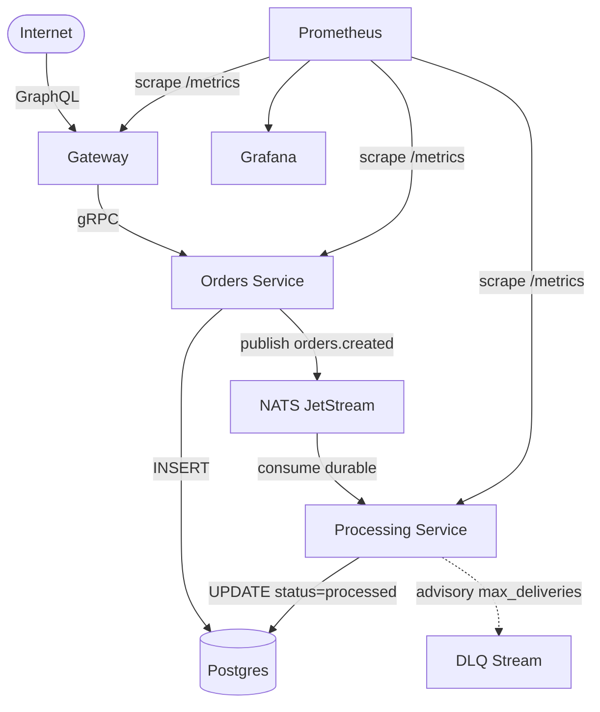

# gcp-kubernetes-roundtrip

[](https://github.com/gusrodriguez/gcp-kubernetes-roundtrip/actions/workflows/ci.yml)

End-to-end event-driven microservices on Kubernetes — the **containerized** counterpart to [`azure-serverless-roundtrip`](https://github.com/gusrodriguez/azure-serverless-roundtrip). Both repos implement the same architectural pattern (HTTP → message broker → async consumer → database, with correlation IDs, DLQ handling, and observability) but with opposite infrastructure philosophies. The serverless version uses Azure Functions, Service Bus, and Cosmos DB — fully managed, pay-per-invocation, zero operational ownership. This one runs long-lived processes, an in-cluster message broker, self-hosted Postgres, connection pools, and self-managed observability — full operational ownership, full control.

### Serverless vs Serverfull at a Glance

|                        | [azure-serverless-roundtrip](https://github.com/gusrodriguez/azure-serverless-roundtrip) | gcp-kubernetes-roundtrip (this repo) |
|------------------------|-------------------------------------|--------------------------------------|
| Compute                | Azure Functions (pay-per-invocation)| Kubernetes pods (long-running)       |
| Message broker         | Service Bus (managed)               | NATS JetStream (self-hosted)         |
| Database               | Cosmos DB (managed)                 | Postgres StatefulSet (self-hosted)   |
| Dead-letter queue      | Built-in (one config flag)          | Built from primitives (advisories)   |
| Observability          | Application Insights (automatic)    | Prometheus + Grafana (manual)        |
| Connection pooling     | N/A (cold starts per invocation)    | Long-lived pools (serverfull luxury) |
| CI end-to-end test     | Requires live Azure resources       | Fully local in kind (zero cost)      |
| Infrastructure-as-code | Pulumi → Azure                      | Pulumi → GCP                         |
| External API           | HTTP triggers (REST)                | GraphQL (graphql-yoga)               |
| Internal communication | Service Bus queue trigger           | gRPC + NATS pub/sub                  |



## The Flow, Step by Step

1. A client sends a `submitOrder` **GraphQL mutation** to the gateway.
2. The gateway generates a **correlation ID** (UUID v4) and forwards the request to orders-service over **gRPC**, passing the correlation ID as metadata (`x-correlation-id`).
3. Orders-service **validates** the input, **inserts** the order into Postgres with `status: pending`, and **publishes** an `orders.created` event to NATS JetStream with the correlation ID as a message header (`Nats-Correlation-Id`).
4. The mutation returns immediately with `{ orderId, correlationId, status: "pending" }` — the system is async by design.
5. Processing-service's **durable consumer** picks up the event, simulates work, and **updates** the order row to `status: processed` with a timestamp. It **acks** only after the DB write succeeds.
6. If processing fails after 5 retries (`maxDeliver: 5`), JetStream publishes a **max delivery advisory**. The DLQ handler catches it, fetches the original message by stream sequence, and **republishes** it to the `DLQ` stream.

### Following a Correlation ID

Every pino log line across all three services includes `{ correlationId }`. To trace a single order:

```bash
# Across all services at once
kubectl logs -l app.kubernetes.io/part-of=roundtrip --all-containers | grep "abc-123-def"

# Or per service
kubectl logs -l app=gateway | grep "abc-123-def"
kubectl logs -l app=orders-service | grep "abc-123-def"
kubectl logs -l app=processing-service | grep "abc-123-def"

# In the database
kubectl exec -it roundtrip-postgres-0 -- psql -U roundtrip -c \
  "SELECT id, correlation_id, status, created_at, processed_at FROM orders WHERE correlation_id = 'abc-123-def'"
```

The correlation ID travels: GraphQL request → gRPC metadata → NATS message header → processing logs → DB row. One ID, full observability.

## Design Decisions

Each decision below calls out the trade-off and, where relevant, contrasts with the approach taken in the [serverless sibling repo](https://github.com/gusrodriguez/azure-serverless-roundtrip).

### GraphQL at the Edge, gRPC Inside

GraphQL serves the external API: flexible queries, self-documenting schema, and a single ingress point. Internal service-to-service communication uses gRPC: strongly typed contracts from `.proto` files, efficient binary serialization, and bidirectional streaming available when needed. Each protocol where it shines. The serverless repo uses plain HTTP triggers instead — there's no internal RPC boundary because Azure Functions are standalone units that don't call each other.

### Sync (gRPC) vs Async (NATS) Boundaries

The `submitOrder` mutation returns `pending` before any processing happens. The gRPC call is synchronous (validate → insert → publish → respond), but the processing boundary is asynchronous via JetStream. This gives temporal decoupling (producer and consumer don't need to be running simultaneously), natural buffering under load, and independent deployment of processing logic without touching the write path. Both repos use this async pattern — the serverless version returns `202 Accepted` from its HTTP trigger and lets Service Bus deliver the message to the consumer function.

### NATS JetStream In-Cluster vs Managed Pub/Sub

Running NATS inside the cluster makes the architecture fully self-contained and testable in CI (a kind cluster with no cloud credentials). It demonstrates the operational ownership that defines the serverfull end of the spectrum: you own the broker, you configure its streams, you handle its storage. The serverless repo uses Azure Service Bus — a fully managed broker where you configure a queue in Pulumi and never think about storage or replication. GCP Pub/Sub would be the equivalent managed option here; NATS was chosen to show the opposite end of the ownership spectrum.

### DLQ as a Built Pattern vs Built-In

In the serverless repo, dead-lettering is a Service Bus configuration flag: set `maxDeliveryCount: 5` and `deadLetteringOnMessageExpiration: true`, and failed messages land in `tasks/$deadletterqueue` automatically. NATS JetStream gives you the primitives instead: advisory events on delivery exhaustion, stream sequence numbers for fetching messages, and publish for routing them. The DLQ handler in processing-service listens to `$JS.EVENT.ADVISORY.CONSUMER.MAX_DELIVERIES.ORDERS.*`, fetches the exhausted message, and republishes it to a `DLQ` stream. More work, more control — a clear demonstration of the build-it vs buy-it trade-off.

### Shared Postgres, Deliberately

Both services read/write the same `orders` table in one Postgres instance. This is a deliberate simplification: database-per-service buys deploy-time independence but introduces distributed consistency challenges (eventual consistency, saga patterns, cross-service queries). For a reference repo with one table, the honest trade-off is that schema ownership is documented (orders-service owns writes to `pending`, processing-service owns the `processed` transition) rather than enforced by network boundaries. The serverless repo uses Cosmos DB with a single container — same pragmatic choice, different database.

### Postgres In-Cluster (StatefulSet) vs Cloud SQL

The in-cluster StatefulSet with a 1Gi PVC is sufficient for a reference repo and essential for CI (kind cluster, no cloud services). For production, Cloud SQL is the right choice: automated backups, failover, patching, and connection via the Auth Proxy. The StatefulSet here demonstrates the pattern; Cloud SQL replaces it when operational cost matters more than control.

### Long-Lived Connection Pools

Each service creates a `pg.Pool` at module scope that stays warm for the process lifetime. This is the serverfull luxury: connection setup cost is amortised to near zero, and the pool size is predictable. The serverless repo doesn't have this option — Azure Functions cold-start on each invocation, paying connection setup cost every time and risking connection exhaustion under concurrent load. That problem spawned entire solutions like PgBouncer sidecars and managed connection pooling features. Long-running processes sidestep it entirely.

### Prometheus/Grafana Self-Hosted vs App Insights Managed

Observability ownership follows compute ownership. Running Prometheus and Grafana in-cluster means you control scrape intervals, retention, dashboard definitions, and alerting rules as code. The serverless repo uses Application Insights — zero setup, automatic distributed tracing, but you're locked into Azure's retention policies, query language, and pricing tiers. Self-hosted observability completes the serverfull ownership story.

### kind-in-CI as the Proof Strategy

The CI workflow spins up a real Kubernetes cluster (kind), deploys all services with Helm, and runs an end-to-end test that exercises the full flow: GraphQL → gRPC → Postgres → NATS → consumer → DB update. The cluster dies with the runner. This proves the architecture works with zero cloud credentials and zero cost. GKE is a documented deploy target, not a CI dependency.

This is arguably the strongest argument for the serverfull approach over serverless. The entire infrastructure — three services, a message broker, a database, and a monitoring stack — fits inside a single Docker container on a free GitHub Actions runner. The CI pipeline is fully self-contained: no cloud account, no credentials, no cost, no environment to maintain. The serverless sibling repo can't do this. Azure Functions, Service Bus, and Cosmos DB have no local equivalents that fully replicate production behaviour — its CI must deploy to real Azure resources, which means cloud credentials in GitHub secrets, actual Azure costs on every run, and test isolation challenges when multiple PRs deploy to the same environment. With Kubernetes, the test environment is created from scratch on every run and destroyed when the runner dies. Complete reproducibility, complete isolation, zero cost.

### Path-Filtered Monorepo CI

The CI workflow uses path filters to detect which services changed. If only `gateway/` changed, only gateway gets built, tested, and containerized. The e2e test runs only when any service changes. This keeps CI fast as the repo grows — the monorepo serves code organisation without paying the monorepo CI tax.

## Run Locally

Prerequisites: Docker, kind, kubectl, Helm, Node 20, npm.

```bash
# Install dependencies and build
npm ci
npm run build

# Build Docker images
make build

# Create kind cluster, deploy everything, wait for readiness
make kind-up

# Run the e2e smoke test
make e2e

# Tear down
make kind-down
```

## Deploy to GKE

### One-Time Setup

1. **Create infrastructure** with Pulumi:
   ```bash
   cd infra
   npm install
   pulumi up
   ```
   This creates a zonal GKE cluster (free-tier control plane), Artifact Registry, service account, and Workload Identity Federation for GitHub Actions.

2. **Configure GitHub secrets** (from Pulumi outputs):
   - `WIF_PROVIDER`: Workload Identity Federation provider name
   - `WIF_SERVICE_ACCOUNT`: CI service account email

3. **Update** `infra/index.ts` with your GitHub org/repo for the WIF binding.

### Deploy Cycle

```bash
# Scale up nodes (cluster control plane is always free for zonal)
gcloud container clusters resize roundtrip-cluster --zone us-central1-a --num-nodes 2

# Deploy via GitHub Actions: trigger the deploy-gke workflow manually
# Or deploy locally:
make build
# Push images, helm upgrade (see deploy-gke.yml for the exact commands)

# Scale back to 0 when done
gcloud container clusters resize roundtrip-cluster --zone us-central1-a --num-nodes 0
```

### Cost

- **Zonal control plane**: free (GKE free tier)
- **Nodes**: billed only while scaled up (~$0.03/hr per e2-medium)
- **Everything else** (NATS, Postgres, Prometheus, Grafana): runs in-cluster, no additional GCP charges
- **Teardown**: `pulumi destroy` removes all resources

### Teardown

```bash
cd infra
pulumi destroy
```

## Project Structure

```
gateway/               # GraphQL service (graphql-yoga)
orders-service/        # gRPC server + NATS publisher
processing-service/    # JetStream consumer + DLQ handler
proto/                 # Shared .proto files + TS types
charts/roundtrip/      # Umbrella Helm chart with subcharts
infra/                 # Pulumi: GKE + Artifact Registry + IAM
scripts/               # e2e test script
.github/workflows/     # CI (kind) + Deploy (GKE)
```
